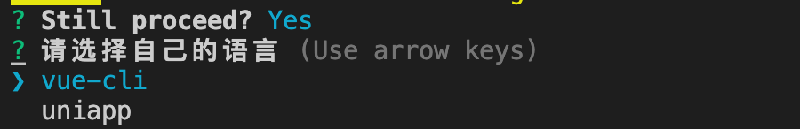
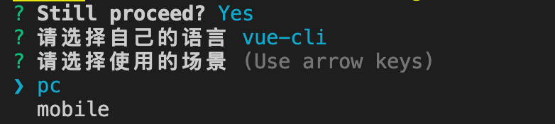
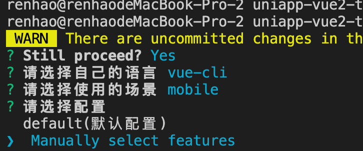
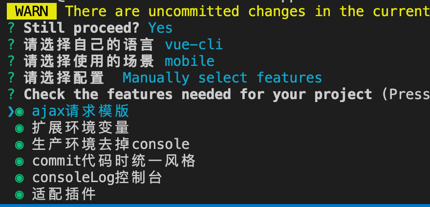
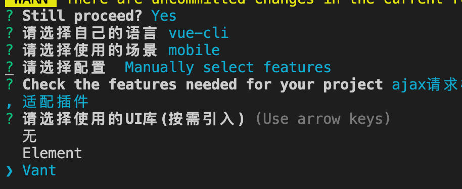

# vue-cli插件xuwu(虚无)模板助手
虚无模版库是通过命令行的方式对vue-cli/vite相关项目进行基础能力的完善，插件中所有的功能均可按照自己的喜好自由安装。
## 用法
```
vue add xuwu
```

## 功能

| 功能 | webpack-web-vue2 | webpack-web-vue3 | webpack-uniapp-vue2 | webpack-uniapp-vue3 |vite2-web-vue3 |vite3-web-vue3 |vite4-web-vue3|vite2-uniapp-vue3 |vite3-uniapp-vue3 |vite4-uniapp-vue3 |
|:---------:|:--------:|:--------:|:--------:|:--------:|:--------:|:--------:|:--------:|:--------:|:--------:|:--------:|
|ajax请求|✅|✅|✅|✅|✅|✅|✅|✅|✅|✅|
|扩展环境变量|✅|✅|✅|✅|✅|✅|✅|✅|✅|✅|
|去掉console|✅|✅|❌|❌|✅|✅|✅|❌|❌|❌|
|统一代码风格|✅|✅|✅|✅|✅|✅|✅|✅|✅|✅|
|consoleLog控制台|✅|✅|❌|❌|✅|✅|✅|❌|❌|❌|
|移动端适配|✅|✅|❌|❌|✅|✅|✅|❌|❌|❌|
|SVG解析|❌|❌|❌|❌|✅|✅|✅|❌|❌|❌|
|打包体积分析|✅|✅|❌|❌|✅|✅|✅|❌|❌|❌|
|pinia|❌|❌|❌|❌|✅|✅|✅|✅|✅|✅|
|ES6为ES5|✅|❌|❌|❌|❌|❌|❌|❌|❌|❌|
|Element|✅|✅|❌|❌|✅|✅|✅|❌|❌|❌|
|vant|✅|✅|❌|❌|✅|✅|✅|❌|❌|❌|
|file工具库|✅|✅|❌|❌|✅|✅|✅|❌|❌|❌|
|mitt通信|❌|❌|❌|❌|✅|✅|✅|❌|❌|❌|


## 安装教程
```
1、第一步，先使用vue-cli创建一个新的工程
2、在创建的工程中执行:vue add xuwu
```
>### 1.选择自己的语言，目前可以选择vue-cli和uniapp两种  
>   
> ### 2.选择项目的使用场景，可以选择pc端还是移动端
> 
> ### 3.选择推荐的功能还是自定义选择。
> 
> ### 4. 自定义选择包括全部的功能选项
> 
> ### 5. 请选择要使用的ui库，目前移动端默认使用vant，pc端默认使用element
> 

## 更新记录
[点击查看更新记录](./RELEASE.md)

## 展望未来
插件内部会陆续扩展一些其他功能，敬请期待

## 联系方式
#### 扫码加入QQ群
##### QQ群：826303267

